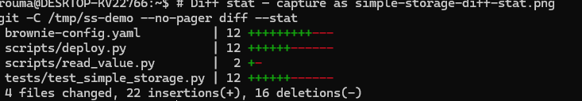
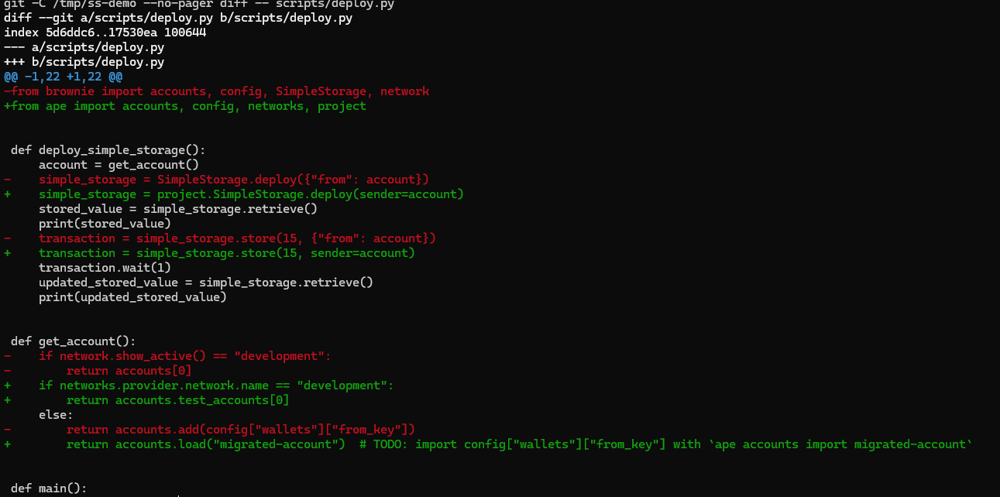
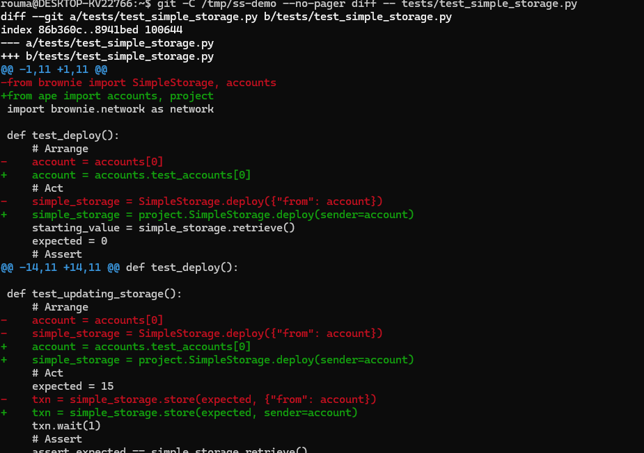
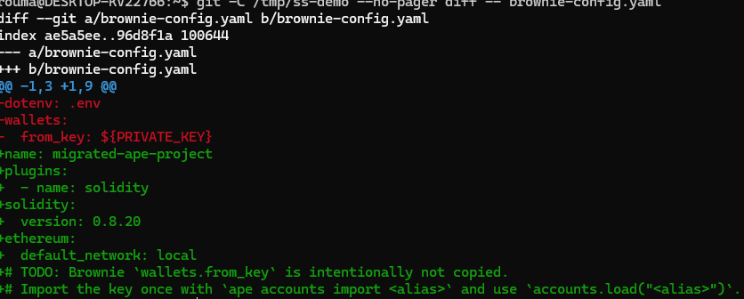

# brownie-to-ape

Hybrid AST + AI Codemod for migrating Python Ethereum projects from
[Brownie](https://github.com/eth-brownie/brownie#readme) to
[Ape Framework](https://docs.apeworx.io/ape).

Brownie's README says Brownie is no longer actively maintained and points Python
Ethereum developers toward Ape Framework. `brownie-to-ape` turns that migration
into a repeatable Codemod workflow: seven deterministic `jssg` / ast-grep
transforms handle the safe majority of code changes first, then one constrained
AI step handles only documented edge cases that remain.

## Real-World Result

`brownie-to-ape` was tested on three public Brownie repositories:

| Repository | Files changed | Brownie patterns before | Brownie patterns after | Automated | Remaining |
| --- | --- | --- | --- | --- | --- |
| [`smartcontractkit/chainlink-mix`](https://github.com/smartcontractkit/chainlink-mix) | 19 | 77 | 8 | 89.6% | 10.4% |
| [`PatrickAlphaC/brownie_simple_storage`](https://github.com/PatrickAlphaC/brownie_simple_storage) | 4 | 9 | 0 | 100.0% | 0.0% |
| [`PatrickAlphaC/brownie_fund_me`](https://github.com/PatrickAlphaC/brownie_fund_me) | 6 | 5 | 1 | 80.0% | 20.0% |
| **Combined** | **29** | **91** | **9** | **90.1%** | **9.9%** |

Metric basis: Brownie-specific Python/YAML signatures before and after the
workflow, excluding generated build artifacts. The measured result is **80%+
automated on real projects**, with remaining work concentrated in dynamic
wrappers, legacy `web3.eth.contract(...)` event filters, Brownie conversion
helpers, and project-specific exception handling.

Full run notes are in:

- [`real-repo-test-results.md`](real-repo-test-results.md)
- [`test-results-chainlink-mix.md`](test-results-chainlink-mix.md)

## One-Command Usage

Run against an existing Brownie project clone:

```bash
git clone https://github.com/dmetagame/brownie-to-ape.git
cd brownie-to-ape
npx codemod workflow run -w workflow.yaml --target /path/to/brownie-project --dry-run --allow-dirty
```

Or run directly from the registry:

```bash
npx codemod brownie-to-ape --target /path/to/brownie-project --dry-run
```

## What It Migrates

- Brownie imports to Ape imports
- `accounts[0]`, `accounts.add(...)`, `Account.from_key(...)`, and `LocalAccount`
- `Contract.at(...)`, `Contract.from_abi(...)`, project contract containers, interfaces, and deploy calls
- Brownie transaction dictionaries like `{"from": account}` to Ape keyword arguments such as `sender=account`
- `network.show_active()`, `network.connect(...)`, `web3.eth.*`, and chain-id patterns
- Brownie pytest helpers, isolation fixtures, event dictionaries, `brownie.reverts`, and `brownie.test.strategy`
- `project.load(...)`, `run(...)`, Click entrypoints, and Brownie script helpers
- `brownie-config.yaml` / `brownie-config.yml` to Ape-style config

## Before / After: simple_storage

From [`PatrickAlphaC/brownie_simple_storage`](https://github.com/PatrickAlphaC/brownie_simple_storage):

```diff
-from brownie import accounts, config, SimpleStorage, network
+from ape import accounts, config, networks, project
 
 def deploy_simple_storage():
     account = get_account()
-    simple_storage = SimpleStorage.deploy({"from": account})
+    simple_storage = project.SimpleStorage.deploy(sender=account)
     stored_value = simple_storage.retrieve()
     print(stored_value)
-    transaction = simple_storage.store(15, {"from": account})
+    transaction = simple_storage.store(15, sender=account)
     transaction.wait(1)
 
 def get_account():
-    if network.show_active() == "development":
-        return accounts[0]
+    if networks.provider.network.name == "development":
+        return accounts.test_accounts[0]
     else:
-        return accounts.add(config["wallets"]["from_key"])
+        return accounts.load("migrated-account")  # TODO: import config["wallets"]["from_key"] with `ape accounts import migrated-account`
```

Test deployment example:

```diff
-from brownie import SimpleStorage, accounts
+from ape import accounts, project
 
 def test_deploy():
-    account = accounts[0]
-    simple_storage = SimpleStorage.deploy({"from": account})
+    account = accounts.test_accounts[0]
+    simple_storage = project.SimpleStorage.deploy(sender=account)
     assert simple_storage.retrieve() == 0
```

## Before / After: chainlink-mix

From [`smartcontractkit/chainlink-mix`](https://github.com/smartcontractkit/chainlink-mix):

```diff
-from brownie import APIConsumer, config, network
+from ape import config, networks, project
 from web3 import Web3
 
 def deploy_api_consumer():
-    jobId = config["networks"][network.show_active()]["jobId"]
-    fee = config["networks"][network.show_active()]["fee"]
+    jobId = config["networks"][networks.provider.network.name]["jobId"]
+    fee = config["networks"][networks.provider.network.name]["fee"]
     account = get_account()
     oracle = get_contract("oracle").address
     link_token = get_contract("link_token").address
-    api_consumer = APIConsumer.deploy(
+    api_consumer = project.APIConsumer.deploy(
         oracle,
         Web3.toHex(text=jobId),
         fee,
         link_token,
-        {"from": account},
+        sender=account,
     )
```

Config migration example:

```diff
-compiler:
-  solc:
-    remappings:
-      - "@chainlink=smartcontractkit/chainlink-brownie-contracts@0.6.1"
-      - "@openzeppelin=OpenZeppelin/openzeppelin-contracts@4.3.2"
-wallets:
-  from_key: ${PRIVATE_KEY}
+name: migrated-ape-project
+plugins:
+  - name: solidity
+solidity:
+  import_remapping:
+    - "@chainlink=smartcontractkit/chainlink-brownie-contracts@0.6.1"
+    - "@openzeppelin=OpenZeppelin/openzeppelin-contracts@4.3.2"
+ethereum:
+  default_network: local
+# TODO: Brownie `wallets.from_key` is intentionally not copied.
+# Import the key once with `ape accounts import <alias>` and use `accounts.load("<alias>")`.
```

## How It Works

The workflow is deliberately hybrid:

1. Deterministic transforms run first on Python and YAML files using Codemod
   `jssg` with ast-grep.
2. Each deterministic transform owns a narrow migration category and avoids
   broad rewrites.
3. A single Codemod built-in AI step runs last, after the safe mechanical
   changes are already applied.
4. The AI step is constrained by a system prompt that requires official Ape docs,
   forbids invented APIs, preserves business logic, and leaves short
   `TODO(brownie-to-ape)` comments when project context is required.

Deterministic transform order:

1. `src/transforms/imports.ts`
2. `src/transforms/accounts.ts`
3. `src/transforms/contracts.ts`
4. `src/transforms/networks.ts`
5. `src/transforms/testing.ts`
6. `src/transforms/project-cli.ts`
7. `src/transforms/config-yaml.ts`

The final AI step only handles the remaining edge cases:

- complex custom deployment scripts
- legacy `web3.py` / Brownie wrapper code
- non-standard account and contract patterns
- heavy pytest mocking
- remaining deprecated Brownie APIs after deterministic transforms

See [`src/ai-edge-cases.md`](src/ai-edge-cases.md) for examples of what the AI
step should and should not touch.

## Screenshots / Diff Placeholders

Use these slots in the hackathon submission or Codemod Registry listing:

| Asset | Placeholder | Capture command |
| --- | --- | --- |
| Dry-run overview | `docs/screenshots/dry-run-simple-storage.png` | `npx codemod workflow run -w workflow.yaml --target /tmp/brownie-simple-storage-demo --dry-run --allow-dirty` |
| Chainlink diff stat | `docs/screenshots/chainlink-mix-diff-stat.png` | `cd /tmp/chainlink-mix-brownie-to-ape-2 && git diff --stat` |
| Simple Storage deploy diff | `docs/screenshots/simple-storage-deploy-diff.png` | `cd /tmp/brownie-simple-storage-brownie-to-ape && git diff -- scripts/deploy.py` |
| Combined metrics table | `docs/screenshots/real-repo-metrics.png` | Open `real-repo-test-results.md` and capture the metrics table |

## Demo Commands

Chainlink mix dry-run:

```bash
cd /tmp
git clone https://github.com/smartcontractkit/chainlink-mix.git chainlink-mix-brownie-to-ape
cd /path/to/brownie-to-ape
npm install
npm test
npx codemod workflow run -w workflow.yaml --target /tmp/chainlink-mix-brownie-to-ape --dry-run --allow-dirty
```

Simple Storage dry-run and apply:

```bash
cd /tmp
git clone https://github.com/PatrickAlphaC/brownie_simple_storage.git brownie-simple-storage-brownie-to-ape
cd /path/to/brownie-to-ape
npx codemod workflow run -w workflow.yaml --target /tmp/brownie-simple-storage-brownie-to-ape --dry-run --allow-dirty
npx codemod workflow run -w workflow.yaml --target /tmp/brownie-simple-storage-brownie-to-ape --allow-dirty
cd /tmp/brownie-simple-storage-brownie-to-ape
git diff --stat
```

Expected changes:

- imports move from Brownie to Ape
- deployment calls use `project.ContractName.deploy(..., sender=account)`
- local accounts move toward `accounts.test_accounts[index]`
- private-key loading is converted to `accounts.load(...)` with manual import guidance
- network checks move from `network.show_active()` to `networks.provider.network.name`
- Brownie config receives an Ape-style starter config
- ambiguous dynamic wrappers remain for review instead of being guessed

## Development

Install and validate:

```bash
npm install
npm test
```

Run the workflow against fixtures:

```bash
npx codemod workflow run -w workflow.yaml --target fixtures --dry-run --allow-dirty
```

Current local validation:

```text
ok: 17 fixture pairs
13 jssg transform snapshot cases
```

## Publishing

Validate before publishing:

```bash
npm test
npx codemod workflow validate -w workflow.yaml
```

Publish to Codemod Registry:

```bash
npx codemod publish .
```

## References

- Ape Framework docs: https://docs.apeworx.io/ape
- Ape quickstart: https://docs.apeworx.io/ape/stable/userguides/quickstart
- Ape accounts guide: https://docs.apeworx.io/ape/stable/userguides/accounts.html
- Ape contracts guide: https://docs.apeworx.io/ape/stable/userguides/contracts.html
- Ape networks guide: https://docs.apeworx.io/ape/stable/userguides/networks.html
- Ape scripts guide: https://docs.apeworx.io/ape/stable/userguides/scripts.html
- Ape testing guide: https://docs.apeworx.io/ape/latest/userguides/testing.html
- Brownie deprecation notice: https://github.com/eth-brownie/brownie#readme
- Codemod workflow reference: https://docs.codemod.com/cli/packages/building-workflows

## Screenshots

### Dry-run diff stat



### Deploy script migration



### Test file migration



### Config migration



## Why the AI step made zero edits

In the smoke tests on `chainlink-mix`, `brownie_simple_storage`, and `brownie_fund_me`, the AI step made zero edits. This is the intended behavior: the seven deterministic transforms were comprehensive enough to handle the safely rewritable Brownie patterns in these repos. The AI step activates only when documented Ape equivalents exist for patterns the deterministic transforms intentionally skip, such as dynamic wrappers, custom account classes, complex event dictionary usage, or legacy `web3.py` event filters. Its zero-edit result is a signal of deterministic coverage, not a misconfiguration.
